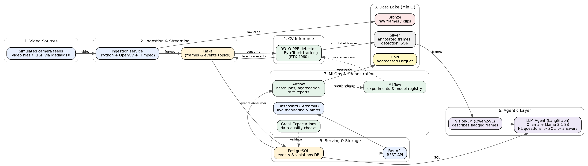

# Fiche de Cadrage — SafeSite AI

**Intelligent PPE Compliance Monitoring Platform**

| | |
|---|---|
| **Project type** | PFA (Projet de Fin d'Année) — end-to-end data platform |
| **Duration** | ~7 weeks |
| **Team size** | 2–3 students |
| **Hardware** | Single laptop with NVIDIA RTX 4060 (8 GB VRAM) |
| **Budget** | 0 — 100% free and open-source, everything runs locally |
| **Domains covered** | Data Engineering · Computer Vision · Streaming · MLOps · LLM Agents |

---

## 1. Context & Problem Statement (La Problématique)

Workplace accidents remain a major cause of injury and death worldwide, and a large share of serious injuries on construction sites and in factories happen when workers are not wearing their **Personal Protective Equipment (PPE)**: helmets, safety vests, gloves, masks, goggles.

Today, PPE compliance is enforced almost entirely by **manual supervision**:

- A safety officer cannot watch every worker, on every camera, at every moment.
- Manual checks are sporadic, subjective, and leave no exploitable data trail.
- When an incident happens, there is rarely structured evidence of the compliance situation before it.
- Site managers have **no analytics**: no compliance rates over time, no identification of high-risk zones or high-risk hours.

Meanwhile, most sites already have cameras. The video exists — the intelligence to exploit it does not.

**Problem statement:** *How can we automatically, continuously, and reliably monitor PPE compliance from standard video feeds, store the resulting events as exploitable data, and make that data accessible to non-technical safety managers — using only open-source tools and commodity hardware?*

## 2. Proposed Solution

**SafeSite AI** is an end-to-end platform that transforms raw video streams into safety intelligence:

1. **Ingests** video feeds (simulated cameras) through a real streaming pipeline.
2. **Detects** workers and their PPE (helmet, vest, mask — and their *absence*) in near real time with a fine-tuned YOLO model, and **tracks** individuals across frames so one worker without a helmet generates one violation, not 500.
3. **Stores** everything properly: raw video in a data lake, structured violation events in a database, aggregated analytics in Parquet — a real data engineering architecture.
4. **Monitors itself**: experiment tracking, model registry, data-quality checks, drift detection on incoming footage, and a live dashboard — real MLOps.
5. **Answers questions in natural language** through an LLM agent running locally: a safety manager can ask *"How many helmet violations occurred yesterday in zone B?"* or *"Describe the incident at 14:32"* and get an answer grounded in the events database and the flagged frames.

The scientific/technical originality is the **combination**: not a CV demo, not a chatbot, but a full production-style platform where each layer feeds the next.

## 3. Objectives

### 3.1 Functional objectives (what the system must do)

- F1 — Ingest at least 2 simulated camera streams simultaneously.
- F2 — Detect ≥ 3 PPE classes and their negative counterparts (e.g., helmet / no-helmet) with usable accuracy (target mAP@50 ≥ 0.75 on the test set).
- F3 — Track individuals to deduplicate violations (one event per person per violation episode).
- F4 — Persist every violation as a structured event (timestamp, camera, violation type, track ID, frame reference).
- F5 — Expose events through a REST API and a live dashboard with compliance KPIs.
- F6 — Answer natural-language questions about the events via a local LLM agent (text-to-SQL over the events DB).
- F7 — Describe a flagged frame on demand via a local vision-language model.
- F8 — Run data-quality validations on the events table and report failures.
- F9 — Produce daily aggregations and a drift report via scheduled batch jobs.
- F10 — The whole platform starts with a single `docker compose up`.

### 3.2 Learning objectives (why we are really doing this)

Each member must be able to explain and defend every component in a technical interview. Concretely, the project forces hands-on learning of:

- **Data engineering**: streaming vs. batch, message brokers, data lake zones (bronze/silver/gold), file formats (Parquet), orchestration, data quality.
- **Computer vision**: object detection, fine-tuning, evaluation metrics (mAP, precision/recall), multi-object tracking, real-time inference constraints.
- **MLOps**: experiment tracking, model registry, monitoring, data drift, reproducibility.
- **LLM engineering**: local model serving, agent design, tool calling, text-to-SQL, vision-language models, hallucination control.
- **Software engineering**: Docker, Git workflow, REST APIs, project structure, documentation.

## 4. Scope

### In scope

- Simulated live feeds (looped video files served as RTSP streams) — indistinguishable from real cameras from the pipeline's point of view.
- Fine-tuning pretrained YOLO models on public PPE datasets.
- Single-machine deployment via Docker Compose.
- English UI and documentation.

### Out of scope (deliberately)

- Real camera hardware and on-site deployment.
- Kubernetes / multi-node deployment.
- Training detection models from scratch.
- Face recognition or worker identification (ethical/legal minefield — we track anonymous IDs only).
- Mobile app, authentication/user management, cloud services.

> **Scope rule:** any feature idea that appears mid-project goes into a `LATER.md` file, not into the sprint.

## 5. Architecture



### 5.1 Layer-by-layer description

**Layer 1 — Video sources.** Free stock videos of construction sites (Pexels/Pixabay) are looped and served as real RTSP streams by MediaMTX. The rest of the platform consumes them exactly as it would consume real IP cameras.

**Layer 2 — Ingestion & streaming.** A Python ingestion service reads the streams with OpenCV, samples frames (e.g., 5 fps — full fps is useless for PPE), assigns metadata (camera ID, timestamp), publishes frames references to a **Kafka** topic, and archives raw clips to the data lake.

**Layer 3 — Data lake (MinIO), medallion architecture.**

- *Bronze*: raw clips and frames, untouched.
- *Silver*: annotated frames and detection JSON produced by the CV service.
- *Gold*: daily aggregated Parquet tables (compliance rate per camera/hour/class) produced by Airflow.

**Layer 4 — CV inference.** A consumer service pulls frames from Kafka and runs the fine-tuned **YOLO** PPE detector plus **ByteTrack** tracking on the GPU. Detections become structured *events*; a violation event is emitted when a tracked person lacks required PPE for N consecutive frames (debouncing).

**Layer 5 — Serving & storage.** Events land in **PostgreSQL** (the system's single source of truth for analytics). **FastAPI** exposes them (`/violations`, `/stats`, `/cameras/...`).

**Layer 6 — Agentic layer.** A **LangGraph** agent powered by a local Llama 3.1 8B (via **Ollama**) translates natural-language questions into SQL against Postgres, executes them through a restricted read-only tool, and composes grounded answers. A second tool sends flagged frames to **Qwen2-VL** for visual descriptions ("a worker near the crane is not wearing a helmet").

**Layer 7 — MLOps & orchestration.** **MLflow** tracks every training run and versions models; the inference service loads models from its registry. **Airflow** schedules nightly aggregation (silver → gold), data-quality runs, and drift reports (e.g., brightness/blur distribution shifts vs. training data). **Great Expectations** validates the events table. A **Streamlit** dashboard shows live KPIs, recent violations with frames, and model-health panels.

### 5.2 Main data flow

```
video → ingestion → Kafka(frames) → YOLO+ByteTrack → Kafka(events) → PostgreSQL
                 ↘ MinIO bronze          ↘ MinIO silver                 ↓
                                                    FastAPI → Dashboard | LLM agent
```

## 6. Technology Stack — What, Why, and What to Learn First

> **Golden rule of this project: learn before you build.** No component is implemented before the team has done the corresponding mini-exercise below. Budget: half a day to one day of learning per tool.

### 6.1 Foundations

**Git & GitHub** — version control: records every change, lets several people work on the same codebase without overwriting each other.
*Learn first:* clone/branch/commit/push/pull, pull requests, resolving a merge conflict.
*Mini-exercise:* each member creates a branch, edits the same README, opens a PR, resolves the conflict.

**Docker & Docker Compose** — packages each service (Kafka, Postgres, our Python apps…) into isolated containers, so the whole platform runs identically on any machine. Compose describes and starts the full multi-container stack from one YAML file. This is the backbone: ~8 services live in it.
*Learn first:* images vs. containers, Dockerfile, volumes (data that survives restarts), networks (how containers talk), `docker compose up/down/logs`.
*Mini-exercise:* write a compose file with Postgres + a tiny Python script that connects and inserts a row.

**Markdown** — the plain-text format of this very document and of every README on GitHub. You write `# title`, `**bold**`, `- list` and it renders as formatted text. Why we use it: it lives in the Git repo like code, diffs cleanly, and renders automatically on GitHub — a Word file can do none of that.
*Learn first:* 20 minutes on basic syntax. That's all it takes.

### 6.2 Data engineering

**Apache Kafka** — a distributed message broker: producers publish messages to *topics*, consumers read them independently at their own pace. It decouples ingestion from inference — if YOLO slows down, frames queue up instead of being lost.
*Learn first:* topics, partitions, producers/consumers, consumer groups, offsets. Understand *why* a broker beats direct calls between services.
*Mini-exercise:* run Kafka in Docker; write a Python producer sending JSON messages and a consumer printing them (`confluent-kafka` library).
*Fallback:* if Kafka fights you > 2 days, Redis Streams delivers the same pattern with far less configuration.

**MinIO** — self-hosted object storage, API-compatible with Amazon S3. It is our **data lake**: cheap, schema-free storage for anything (videos, images, Parquet). Everything you learn transfers 1:1 to AWS S3.
*Learn first:* object storage vs. file system, buckets, the medallion (bronze/silver/gold) pattern and why raw data is kept immutable.
*Mini-exercise:* run MinIO in Docker, upload/download files from Python with `boto3`.

**PostgreSQL** — the reference open-source relational database; stores our structured events and powers all analytics and the agent's SQL.
*Learn first:* schema design, primary/foreign keys, indexes, `GROUP BY` aggregations, window functions (for "violations per hour" style queries).
*Mini-exercise:* design the `violations` table, insert fake events, write the 5 analytical queries the dashboard will need.

**Apache Airflow** — batch orchestrator: you define workflows as Python DAGs (directed acyclic graphs of tasks) and it runs them on schedule, retries failures, and shows everything in a UI. Ours runs the nightly aggregation, data-quality, and drift jobs.
*Learn first:* DAGs, tasks, operators, scheduling, idempotency (a job re-run must not duplicate data).
*Mini-exercise:* a 2-task DAG — task 1 writes a CSV, task 2 reads it and logs row count — scheduled every 5 minutes.

**Parquet (+ Pandas/PyArrow)** — columnar file format for analytics: 10–50× smaller and faster than CSV for aggregation queries. Format of our gold layer.
*Learn first:* row vs. columnar storage, when Parquet beats CSV.
*Mini-exercise:* convert a 1M-row CSV to Parquet, compare file size and query time.

**Great Expectations** — data-quality framework: you declare expectations ("timestamp is never null", "violation_type ∈ allowed set") and it validates batches and produces reports. This is how real teams stop garbage data from silently corrupting analytics.
*Learn first:* expectations, validation results, integrating a check into a pipeline step.
*Mini-exercise:* write 5 expectations for the violations table; make one fail on purpose and read the report.

### 6.3 Computer vision

**YOLO (Ultralytics)** — real-time object detector: one neural network pass per image returns bounding boxes + classes. We **fine-tune** a pretrained model (yolov8s/yolo11s) on public PPE datasets instead of training from scratch.
*Learn first:* how detection differs from classification, anchor-free detection at a high level, fine-tuning vs. from scratch, and the metrics — IoU, precision, recall, mAP@50 — well enough to explain them at a whiteboard.
*Mini-exercise:* fine-tune yolov8n on a small Roboflow PPE dataset (1–2 h on the 4060), evaluate, run inference on a Pexels construction video, watch the failure cases.
*Datasets:* Roboflow Construction Site Safety (has NO-helmet/NO-vest classes) first; SH17 (8k images, 17 classes) for robustness later.

**ByteTrack (multi-object tracking)** — associates detections across frames so each person keeps a stable ID. Without it, one violation is counted hundreds of times.
*Learn first:* tracking-by-detection, ID switches, why simple IoU matching fails when people cross paths.
*Mini-exercise:* run Ultralytics' built-in `model.track()` on a crowd video and observe when IDs break.

**OpenCV + FFmpeg + MediaMTX** — OpenCV reads/decodes video and manipulates frames in Python; FFmpeg converts/streams video from the CLI; MediaMTX turns our video files into real RTSP camera streams.
*Learn first:* frames/fps/codecs basics, reading a stream frame-by-frame in OpenCV.
*Mini-exercise:* serve a video file as RTSP with MediaMTX and read it live from OpenCV — this *is* Layer 1, learned.

### 6.4 LLM & agentic layer

**Ollama** — runs open LLMs locally with one command (`ollama run llama3.1:8b`) and exposes an OpenAI-compatible API. Zero cost, no data leaves the machine. An 8B model in 4-bit quantization fits the 4060's 8 GB VRAM.
*Learn first:* what quantization is and why it lets 8B fit in 8 GB; context windows; the chat completion API shape.
*Mini-exercise:* pull llama3.1:8b, call it from Python via the API, measure tokens/second.

**LangGraph** — framework for building agents as explicit graphs: nodes (LLM calls, tool executions) + edges (control flow, loops). More debuggable than "magic" agent frameworks — you always know which step you're in.
*Learn first:* what an agent is (LLM + tools + loop), tool calling, state graphs; the difference between a chatbot and an agent.
*Mini-exercise:* build a 1-tool agent (a calculator tool) then a text-to-SQL agent over a toy SQLite DB — validate the SQL, execute read-only, return the answer.
*Safety notes to learn:* restrict the agent's DB user to read-only; validate generated SQL; make the agent answer "I don't know" rather than invent numbers.

**Qwen2-VL 7B (vision-language model)** — an LLM that also sees images; used to produce human-readable descriptions of flagged frames.
*Learn first:* what a VLM is; prompt + image → text; VRAM management (you cannot keep YOLO, Llama and Qwen2-VL loaded simultaneously on 8 GB — load/unload or use Ollama's model swapping).
*Mini-exercise:* send a construction-site photo to Qwen2-VL via Ollama and ask "is anyone not wearing a helmet?" — compare with YOLO's opinion.

### 6.5 MLOps & serving

**MLflow** — experiment tracking (params, metrics, artifacts of every training run) + model registry (versioned models with stages). Answers "which model is in production and how was it trained?" — reproducibility.
*Learn first:* runs, experiments, logging API, registry stages.
*Mini-exercise:* wrap the YOLO fine-tuning in MLflow logging; compare 2 runs in the UI; register the best model and load it *from the registry* in an inference script.

**FastAPI** — modern Python web framework for the REST API; automatic validation (Pydantic) and auto-generated Swagger docs.
*Learn first:* routes, path/query parameters, Pydantic models, async basics.
*Mini-exercise:* build `/violations?camera=X&from=...` over the Postgres table; browse the auto docs at `/docs`.

**Streamlit** — turns Python scripts into web dashboards without frontend code. Ours: live KPIs, latest violations gallery, compliance charts, model-health panel.
*Learn first:* widgets, layout, caching, auto-refresh pattern.
*Mini-exercise:* dashboard over fake data: metric cards + a time chart + an images grid.

**Drift detection (concept + Evidently)** — production models degrade when reality drifts from training data (night footage, rain, new camera angle). We monitor input statistics (brightness, blur, detection-confidence distributions) and alert on shifts; the library **Evidently** generates drift reports.
*Learn first:* data drift vs. concept drift; distribution distance at an intuitive level (PSI/KS).
*Mini-exercise:* compute the confidence-score distribution on day-1 events vs. an artificially darkened video; generate an Evidently report showing the drift.

## 7. Methodology & Timeline (7 weeks)

Method: **learn → mini-exercise → implement → integrate**, with an ugly-but-working end-to-end version as early as possible, improved iteratively afterwards. Work in weekly sprints; every piece of work goes through a pull request reviewed by another member.

| Week | Phase | Outcome |
|---|---|---|
| 1 | **Foundations + DE learning** | Git repo, Docker basics done; Kafka/MinIO/Postgres mini-exercises done; compose stack skeleton runs |
| 2 | **Data pipeline** | Video → RTSP → ingestion → Kafka → bronze on MinIO, events schema in Postgres — flowing with dummy detections |
| 3 | **CV core** | YOLO fine-tuned (baseline mAP measured), ByteTrack integrated, real detections flowing into the pipeline end-to-end |
| 4 | **Agent + API** | FastAPI endpoints; LangGraph text-to-SQL agent answering real questions; VLM frame description working |
| 5 | **MLOps** | MLflow tracking + registry wired to inference; Airflow DAGs (aggregation, quality, drift); Great Expectations in place |
| 6 | **Dashboard + hardening** | Streamlit dashboard complete; drift demo scenario; bug-fixing; performance pass (fps, VRAM) |
| 7 | **Delivery** | Demo video, final README + this document updated, architecture walkthrough, report & defense preparation |

**Milestone rule:** end of week 3 = full ugly end-to-end demo (one camera, one class, minimal dashboard). Everything after is enrichment — this guarantees a presentable project even if late phases slip.

## 8. Deliverables

1. GitHub repository (clean structure, PR history, `docker compose up` bootable).
2. Fine-tuned PPE detection model + MLflow experiment history.
3. This fiche de cadrage + final technical report.
4. Architecture diagram (kept up to date).
5. 3–5 minute demo video: live stream → violation detected → appears on dashboard → agent answers a question about it.
6. Defense slides.

## 9. Risks & Mitigations

| Risk | Likelihood | Impact | Mitigation |
|---|---|---|---|
| Kafka/infra rabbit holes eat weeks | High | High | 2-day timebox → fallback to Redis Streams |
| 8 GB VRAM can't hold YOLO + 2 LLMs | High | Medium | Sequential model loading; quantized models; frame sampling; smaller YOLO variant |
| Detection accuracy disappoints on real footage | Medium | Medium | Start with best-quality dataset; add SH17; lower fps; accept and *analyze* failure cases in the report (that's science) |
| Integration hell in week 3 | Medium | High | Contracts first: freeze Kafka message schemas and DB schema in week 1; mock producers/consumers |
| Agent hallucinates numbers | Medium | Medium | Force answers through SQL tool results only; show the executed SQL in the UI; eval set of 20 Q&A pairs |
| Scope creep | High | High | `LATER.md` rule; weekly scope review against this document |
| Team member unavailable | Low | High | Everything in Git; weekly knowledge-sharing session — no component known by only one person |

## 10. Success Criteria

The project is a success if:

1. The full stack boots with one command and survives a 30-minute live demo.
2. F1–F10 functional objectives are met (mAP target may be renegotiated with documented justification).
3. Every team member can explain **every** layer — including the ones they didn't implement — at a whiteboard.
4. The repo is convincing enough to anchor a resume and PFE interviews: clear README, architecture diagram, demo video, honest evaluation section.

---

*Document version 1.0 — to be revised at each weekly sprint review.*
